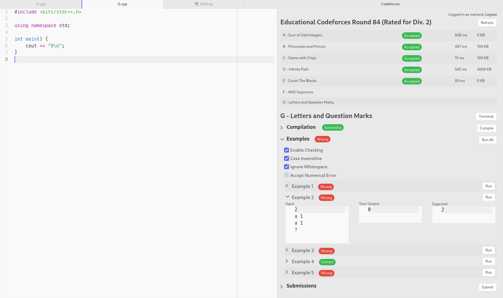
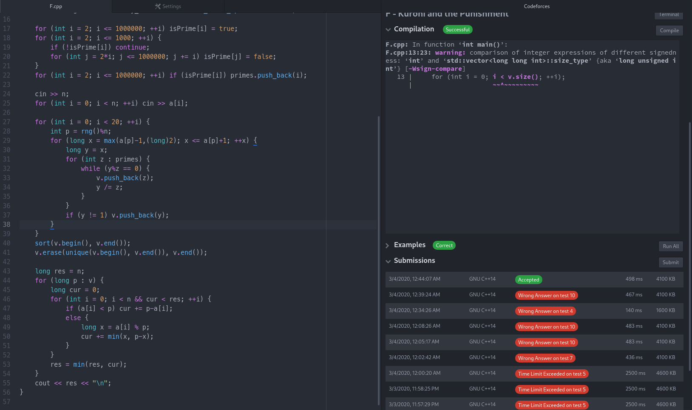

# Atomforces

This plugin for the Atom editor helps you with some workflows during Codeforces contests.
In order to show compilation output and to open terminal sessions inside of Atom, [terminal-tab](https://atom.io/packages/terminal-tab) is required.

## Instructions

- Enter your Codeforces username in the plugin settings and adjust your personal preferences.
- Connect a folder to a past or future Codeforces contest in the Atom tree view by right-clicking a directory and selecting `Connect to Codeforces contest`. The id of a contest can be found by looking at its URL (in case of a future contest, try clicking the `Register` button).
- Open the Atomforces pane with <kbd>Ctrl</kbd> + <kbd>Alt</kbd> + <kbd>o</kbd>.
- Login to Codeforces (necessary for submitting inside of Atom) using the button in the top right of the Atomforces pane. The plugin will not save your password and instead rely on the Codeforces feature letting you stay logged in for 30 days. Afterwards you need to login again.
- Before the start of the contest, the plugin will show a countdown (just select the folder you connected in the tree view and open the Atomforces pane). The Codeforces API is regularly being called to check whether the contest has been delayed.
- As soon as a contest starts, the task information and examples are being downloaded. Source files and examples are being created and the source of the first task is being opened in the editor. During and after the contest, the plugin regularly calls the Codeforces API and updates the shown status of your submissions.
- At any time, you can open any file belonging to a task or contest in the editor or in the tree view to see its information in the Atomforces pane.
- Click on a task in the Atomforces pane to quickly open the corresponding source file.
- Click on a submission to open it in your browser.
- Save a source file to let the plugin automatically compile it and run the examples downloaded from the Codeforces website.
- The plugin checks whether your output is correct by comparing it to the expected output. For every task, you can choose whether the comparison should be case sensitive, whether it should ignore whitespace (for most Codeforces tasks the official checking behavior is similar), and whether numerical errors (absolute or relative) of up to `1e-6` are okay (you should not activate this when you have to output integers). In case multiple outputs are possible or the task is interactive, you can disable the output checking for that task.
- You can add your own examples and let this plugin test them as well by putting them inside of the `examples` directory.
- In order to quickly open a terminal in the directory of a task click on the `Terminal` button in the Atomforces pane.
- Submit a source file using the button in the bottom in the Atomforces pane.
- You can clear all connections of your folders to Codeforces contests and their stored data in the Atom menu under `Packages`, `Atomforces`.

The default directory structure is as follows: the source file for task A is called `A.cpp`, it is located inside of the folder `A` and the compiled file is called `a.out`. The compilation command currently is `g++ -std=c++17 -g -Wall -Wextra -fsanitize=undefined,address -DGLIBCXX_DEBUG A.cpp`. The examples for task A are inside of the directory `A/examples` and are called e.g. `1.in` and `1.out`.
You can change this behavior in the settings.

**Please note** that this plugin is still in development.
Use it on your own risk.
Although I don't think there are any major bugs (of course I am using the plugin myself), I am not responsible in case anything to your disadvantage happens because of the usage of this plugin (e.g. getting worse rating when unfinished source files are being submitted).

Before participating in a rated contest, you should test whether the plugin is working for you by connecting a folder to a past Codeforces contest and trying to submit a source file.

## Screenshots

